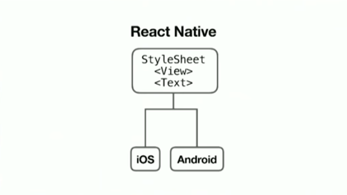
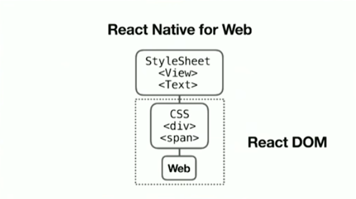
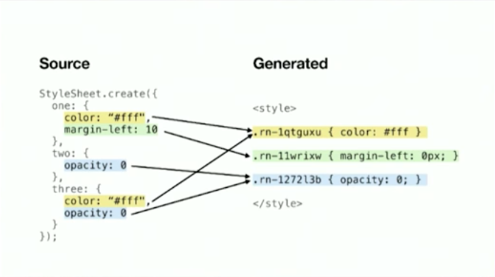
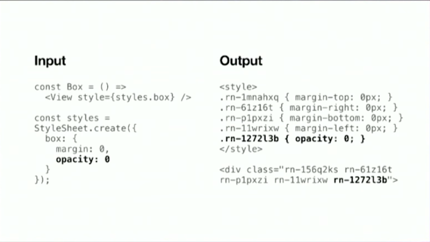
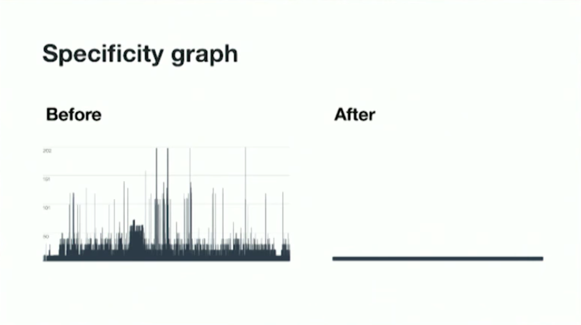
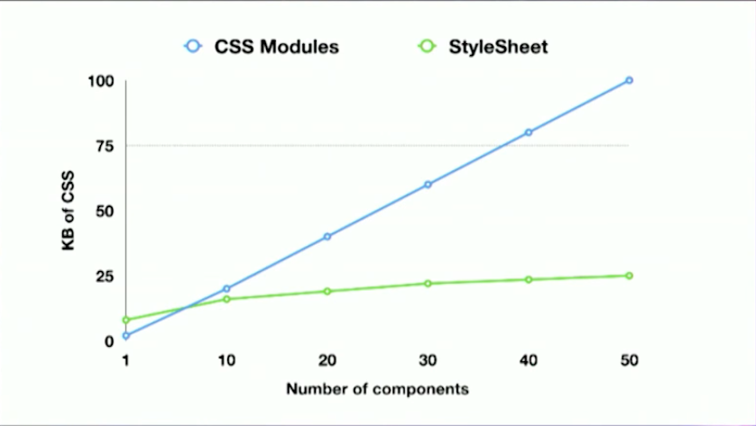
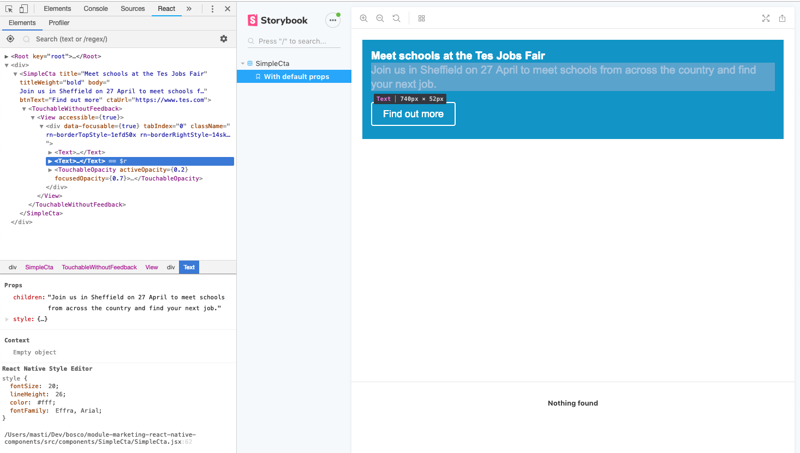
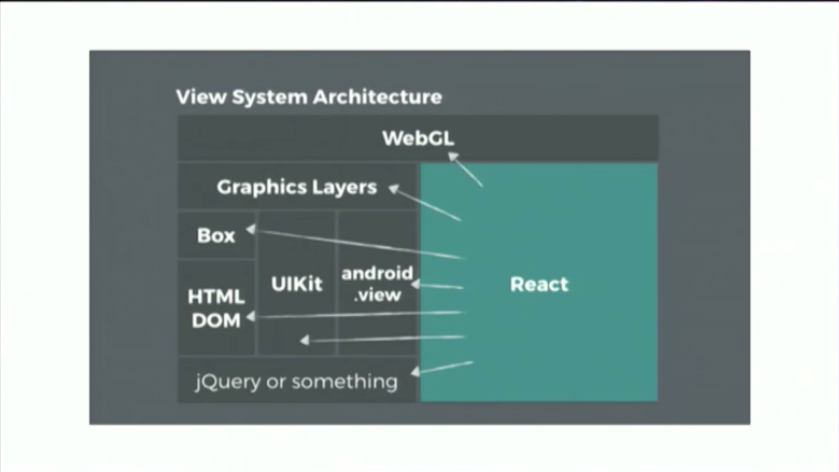

export { future as theme } from 'mdx-deck/themes'
import { Notes, Image } from 'mdx-deck'
import { Split } from 'mdx-deck/layouts'

# React Native Web
## Universal Components

Heavily inspired by

https://www.youtube.com/watch?v=tFFn39lLO-U

---

### What's wrong with the DOM?

---

Primitives are too low level
```jsx
<div>
<span>

<input>
<button>
```
<Notes>
  Easy to make mistakes
  <br /><br />Hard to handle accessibility
  <br /><br />Hard to handle gestures
</Notes>

---

No strict contract

```jsx
<div class="could-do-anything" />
```

<Notes>
You lose control over the component tree and have no idea how it might look like once you add a class
<br />
<br />You also have no idea how far that change can go down the component thanks to CSS descendant selectors
</Notes>

---

A lot of time spent reinventing expressive abstractions

<Notes>
This is even more true when we want to target mobile, responding to gestures, focus management etc
</Notes>

---

### Problems with CSS at scale

1. No local variables
2. Implicit dependencies
3. No dead code elimination
4. No code minification
5. No sharing of constants
6. Non-deterministic resolution
7. No isolation

https://speakerdeck.com/vjeux/react-css-in-js

---

## How about build tools?

<Notes>
Using webpack to bundle css modules you need to make sure the order of importing is correct
<br />import all the dependencies before importing the component that depends on them
</Notes>

---

### It's not because people don't understand CSS

<Notes>
  Problem experienced by many engineers/designers working on large scale apps
  <br />Even when you understand css is not easily to reliably predict what's happening
</Notes>

---

### React Native is a web framework

It was created as an experiment "Web: the good parts"



---

## React Native is easier and simpler than React DOM

---

### React Native Web



---

`StyleSheet.create()`

 - Simple API and expressive subset of CSS.
 - Generates CSS; the minimum required.
 - Good runtime performance.
 - Support for static and dynamic styles.
 - Support for RTL layouts.
 - Easy pre-rendering of critical CSS.

---

StyleSheet - Atomic CSS



---



<Notes>
Deterministic generation across entire app
</Notes>

---

### Specificity



---

CSS modules: grow based on total number of rules

StyleSheet: grow based on total number of unique decorations



---

## Accessibility

```jsx
<View accessibilityTraits="main" >
  => <main role="main">

<Text accessibilityTraits="link" href="/">
  => <a href="/" role="link"/>

<Touchable disabled={true}>
  => <div role="button" tabindex="-1">
```

---

### Debugging
React Native Web compatible with React DevTools



---

## React as UI runtime
https://overreacted.io/react-as-a-ui-runtime/



iOS, Android, OS X, Windows, PDF, console, web, VR, etc...

---

## What are you waiting for? 
Go and build your next web app with React Native Web


Thanks for listening

